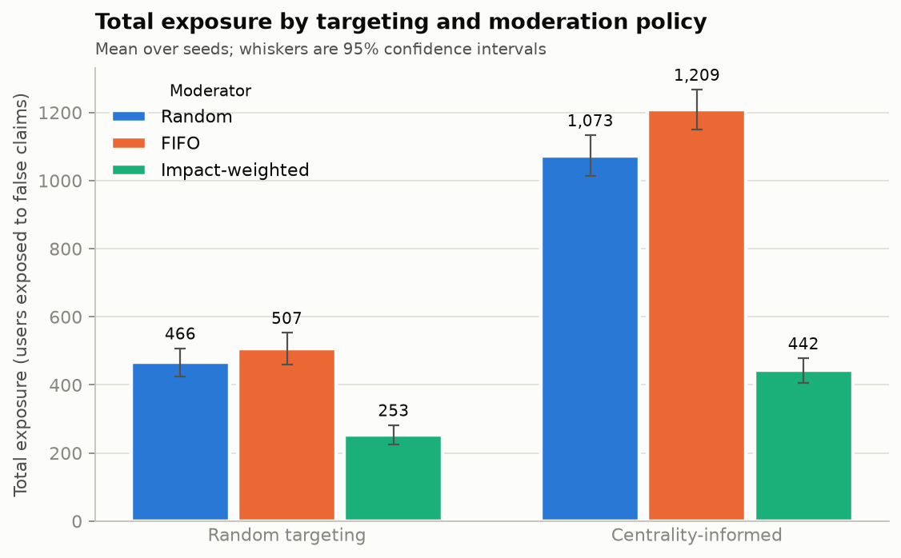
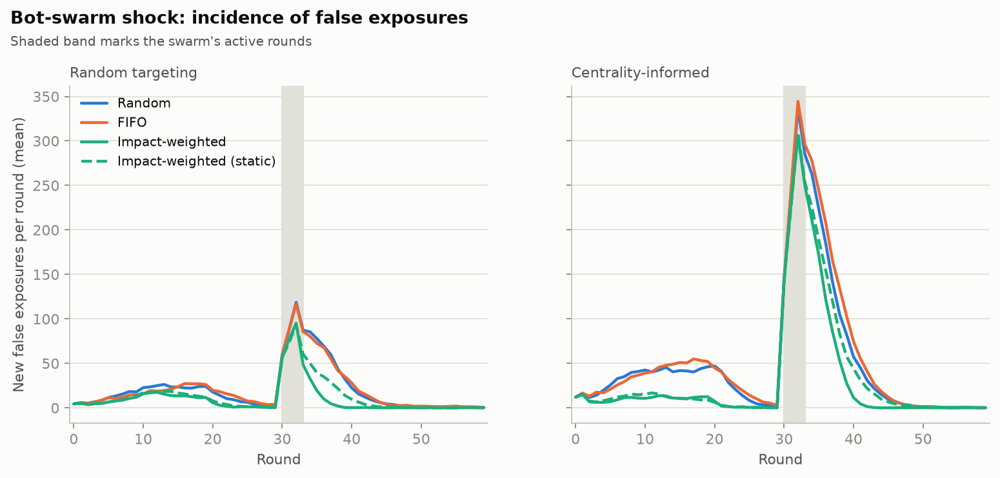
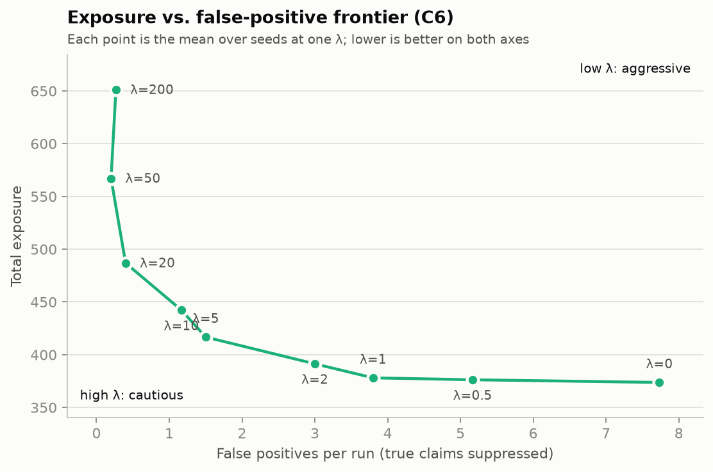

# Infodemic Containment

**Misinformation spreaders vs. fact-checking moderators on a social network.**
A multi-agent adversarial simulation for the Foundations of AI (FOAI) case study.


---

## Table of Contents

- [Quickstart](#quickstart)
- [Overview](#overview)
- [The Problem](#the-problem)
- [Agents](#agents)
- [Environment](#environment)
- [Decision Problems](#decision-problems)
- [Objectives and the λ Trade-off](#objectives-and-the-λ-trade-off)
- [Stress Scenario: Bot-Swarm Shock](#stress-scenario-bot-swarm-shock)
- [Research Questions and Hypotheses](#research-questions-and-hypotheses)
- [Evaluation Plan](#evaluation-plan)
- [Scope and Assumptions](#scope-and-assumptions)
- [Tech Stack](#tech-stack)
- [Getting Started](#getting-started)
- [Repository Layout](#repository-layout)
- [How It Is Modeled](#how-it-is-modeled)
- [Results](#results)
- [Project Status](#project-status)
- [References](#references)

---

## Quickstart

Requires Python 3.10 or newer. From the repository root:

```bash
python3 -m venv .venv && source .venv/bin/activate
pip install -e ".[dev]"
pytest                                    
python experiments/run_matrix.py          # then open results/matrix_exposure.png
```

Two more runners cover the rest of the study: `run_shock.py` (bot-swarm shock)
and `run_lambda_sweep.py` (the λ trade-off). All charts and CSV tables are
written to `results/`. See [Getting Started](#getting-started) for flags and
configuration.

---

## Overview

False stories spread farther and faster than true ones, largely because a small
number of well-connected accounts amplify them. Verification does not scale the
same way: fact-checking is slow, evidence-dependent, and limited by reviewer
capacity. Over-aggressive takedowns also have a cost, because wrongly suppressing
true content erodes user trust.

The result is a **race between propagation speed and verification capacity**,
played out on a network where influence is very unevenly distributed.

This project models that race as a two-player, mixed-motive simulation and asks
where informed search and resource-aware prioritization beat uninformed baselines
in an adversarial, partially observable setting. It also shows how a rule-based
knowledge representation layer fits into a larger agent decision loop.

## The Problem

> Given a social network, a stream of claims (some true, some false, with labels
> hidden from moderators), and a fixed per-round verification budget, how should a
> moderator decide **which claims to verify, when, and what action to take**, in
> order to **minimize total misinformation exposure while limiting wrongful
> takedowns**, against an adversary that actively adapts its spreading strategy?

Three difficulties are built in:

| Difficulty | What it means here |
|---|---|
| **Incomplete information** | Moderators never see ground truth. They infer it from claim content, propagation velocity, and source credibility history. |
| **Scarce resources** | Only `B` claims can be checked per round, so every check has an opportunity cost. |
| **Adaptive opponent** | The spreader observes moderator behavior and changes tactics, so a fixed policy gets exploited. |

A single-agent search or optimization framing fails because the environment
contains another goal-directed agent whose actions change the outcome of yours.

## Agents

There are exactly **two agent types**. Ordinary users are *not* agents. They are
passive nodes that reshare probabilistically.

|  | Spreader Agent | Moderator Agent |
|---|---|---|
| **Goal** | Maximize exposed nodes before containment | Minimize total exposure + λ · false-positive takedowns |
| **Actions** | Post, reshare, create sockpuppets, target hubs | Flag, quarantine / rate-limit, publish counter-claim, escalate |
| **Percepts** | Local engagement, visible moderator activity | Claim content, propagation velocity, source credibility history |
| **Constraint** | Limited posts and accounts per round | Verification budget `B` per round, detection delay |

## Environment

The environment is a **scale-free graph** `G = (V, E)` of roughly **500 to 1000
nodes**. Scale-free structure is used because real social networks have
heavy-tailed degree distributions with a few very influential hubs.

- **Node states:** `clean`, `exposed`, `quarantined`
- **Edge weights:** reshare probability `p(u, v)`, modulated by a trust score
- **Claims:** synthetic predicates with hidden true/false labels, checkable
  against a knowledge base
- **Dynamics:** Independent Cascade. Each newly exposed node gets one chance to
  pass the claim to each neighbor with probability `p(u, v)`

| Property | Justification |
|---|---|
| Partially observable | Moderators infer truth from evidence; spreaders do not know the exact detection threshold |
| Stochastic | User resharing is probabilistic (Independent Cascade Model) |
| Multi-agent, mixed-motive | Adversarial goals, with neutral bystander nodes reacting probabilistically in between |
| Dynamic | The network state changes between an agent's turns |
| Sequential | Containment decisions now change what the spreader can do later |

## Decision Problems

### Spreader

1. **Where to seed the claim:** a random node or a high-centrality hub?
2. **When to deploy sockpuppets,** and how to react to visible moderator activity?

### Moderator

1. **Which claims deserve the `B` checks this round?** Ranking uses estimated
   impact (*propagation velocity × reach of current carriers*) rather than
   arrival order.
2. **How to verify?** Claims are represented as predicates and matched against a
   knowledge base using **Horn-clause rule-based inference**.
3. **What to do when the knowledge base cannot resolve a claim?** Escalate,
   rate-limit provisionally, or ignore. This is where the limits of knowledge
   representation show up honestly.

## Objectives and the λ Trade-off

- **Spreader:** maximize `E[exposed nodes at horizon T]`
- **Moderator:** minimize `Total Exposure + λ · FalsePositives`

The parameter **λ** controls the moderator's caution:

| λ | Moderator behavior | Consequence |
|---|---|---|
| Low | Aggressive | Contains rumors fast, but wrongly suppresses true content |
| High | Cautious | Avoids collateral damage, but lets rumors run longer |

Sweeping λ and reporting the resulting **exposure vs. false-positive frontier**
is a key analytical result of this project.

## Stress Scenario: Bot-Swarm Shock

At a scheduled round, many spreader instances activate simultaneously, mimicking
a breaking-news panic. This tests whether the moderator's policy is robust or
only works on the happy path. The moderator is expected to **re-prioritize under
load** rather than continue with its pre-shock queue.

## Research Questions and Hypotheses

| ID | Statement |
|---|---|
| **RQ1** | How much does informed play beat uninformed play for each side? |
| **H1** | Centrality-targeted spreading reaches significantly more nodes than random targeting at equal post budget. |
| **H2** | Impact-weighted moderation beats FIFO and random moderation on total exposure at equal `B`. |
| **RQ2** | How does the system behave under the bot-swarm shock? |
| **H3** | An adaptive moderator recovers containment within `k` rounds, while a static policy does not. |
| **RQ3** | How does λ shape the exposure vs. false-positive trade-off? |

## Evaluation Plan

A **2 × 3 experiment matrix** (six conditions), run over **multiple random
seeds per condition** because the process is stochastic.

| Spreader \ Moderator | Random | FIFO | Impact-weighted |
|---|---|---|---|
| **Random targeting** | C1 | C2 | C3 |
| **Centrality-informed** | C4 | C5 | C6 |

How the matrix maps to the hypotheses:

- **H1:** compare rows within a column (e.g. C1 vs. C4).
- **H2:** compare columns within a row (e.g. C4 vs. C6).
- **H3:** apply the shock in each condition and compare recovery.
- **RQ3:** sweep λ on the moderator side.

### Metrics (per run)

| Metric | Description |
|---|---|
| Total exposure | Area under the infection curve, i.e. users exposed to false claims summed over all rounds |
| Peak infection | Largest number of users newly exposed to false claims in a single round |
| Time-to-containment | Rounds until new false exposures stay at or below a threshold (default 2 per round); reported as the horizon if never reached |
| False-positive rate | Share of takedowns applied to true content |
| Post-shock recovery time | Rounds after the shock round until new false exposures settle back at or below the threshold |

## Scope and Assumptions

- Claims are **synthetic predicates**. There is no NLP and no real-world content.
- The simulator **holds ground truth**. Moderators receive only noisy evidence,
  and this asymmetry is what makes the environment partially observable.
- Graph structure is **static** apart from node state changes and sockpuppet
  creation.
- The knowledge base is **small and hand-authored**, so results characterize the
  *decision strategy*, not real-world fact-checking accuracy.

## Tech Stack

| Area | Choice | Used for |
|---|---|---|
| Language | Python 3.10+ (developed on 3.14) | Entire simulator, agents, and experiment runners |
| Graph | [NetworkX](https://networkx.org/) | Scale-free graph generation (Barabási–Albert) and degree centrality |
| Numerics | [NumPy](https://numpy.org/) | Seeded random number generation for reproducible runs, and vectorized metric calculations |
| Data handling | [pandas](https://pandas.pydata.org/) | Collecting per-round logs and aggregating results across seeds and conditions |
| Plotting | [Matplotlib](https://matplotlib.org/) | Infection curves, the λ exposure vs. false-positive frontier, and shock recovery plots |
| Configuration | [PyYAML](https://pyyaml.org/) | Experiment configs for the C1–C6 conditions and the λ sweep |
| Testing | [pytest](https://docs.pytest.org/) | Unit tests for cascade dynamics, inference, and policies |
| Knowledge base | Custom pure-Python Horn-clause engine | Hand-authored facts and rules queried by backward chaining, kept in-house so the inference stays transparent |

Design choices:

- **No agent framework or ML library.** Both agents use explicit, inspectable
  policies, which keeps the comparison between strategies clean.
- **Reproducibility.** Every run takes an explicit seed, and each experiment
  condition is repeated over a fixed list of seeds.
- **Dependencies** are declared in `pyproject.toml` and mirrored in
  `requirements.txt`.

## Getting Started

```bash
python3 -m venv .venv
source .venv/bin/activate
pip install -e ".[dev]"

pytest                                   # unit and simulation tests

python experiments/run_matrix.py         # C1-C6 matrix (H1, H2)
python experiments/run_shock.py          # bot-swarm shock in every condition (H3)
python experiments/run_lambda_sweep.py   # exposure vs. false-positive frontier (RQ3)
```

Each runner writes CSV tables and a PNG chart to `results/`. Useful flags:

| Flag | Applies to | Effect |
|---|---|---|
| `--seeds N` | all runners | Use seeds `0..N-1` instead of the config's seed list |
| `--config PATH` | all runners | Use a different config (default `experiments/configs/default.yaml`) |
| `--out DIR` | all runners | Write results somewhere other than `results/` |
| `--k N` | `run_shock.py` | Rounds allowed for recovery in the H3 check (default 15) |
| `--with-static` | `run_shock.py` | Add an ablation whose impact ranking is frozen when a claim is first seen |
| `--condition C6` | `run_lambda_sweep.py` | Which condition to sweep |
| `--lams 0,1,10,100` | `run_lambda_sweep.py` | The λ values to try |

All parameters (graph size, budget `B`, λ, shock size, KB coverage, and so on)
live in `experiments/configs/default.yaml`.

## Repository Layout

```text
FOAI-Case-Study/
├── README.md
├── pyproject.toml
├── requirements.txt
├── .gitignore
├── docs/
│   ├── Infodemic_Containment_Problem_Statement.pdf
│   └── Infodemic_Containment_Problem_Statement.docx
├── src/
│   └── infodemic/
│       ├── __init__.py
│       ├── config.py
│       ├── metrics.py
│       ├── env/
│       │   ├── __init__.py
│       │   ├── network.py
│       │   ├── cascade.py
│       │   ├── claims.py
│       │   └── simulation.py
│       ├── agents/
│       │   ├── __init__.py
│       │   ├── spreader.py
│       │   └── moderator.py
│       ├── policies/
│       │   ├── __init__.py
│       │   ├── spreader_policies.py
│       │   └── moderator_policies.py
│       ├── kb/
│       │   ├── __init__.py
│       │   ├── facts.py
│       │   ├── rules.py
│       │   └── inference.py
│       └── scenarios/
│           ├── __init__.py
│           └── bot_swarm.py
├── experiments/
│   ├── configs/
│   │   ├── default.yaml
│   │   └── conditions.yaml
│   ├── common.py
│   ├── run_matrix.py
│   ├── run_lambda_sweep.py
│   └── run_shock.py
├── tests/
│   ├── test_cascade.py
│   ├── test_inference.py
│   ├── test_policies.py
│   └── test_simulation.py
├── results/
└── report/
```

| Path | Responsibility |
|---|---|
| `src/infodemic/env/` | Scale-free graph, node states, claims with hidden labels, Independent Cascade dynamics, and the round-by-round simulation loop |
| `src/infodemic/agents/` | The two agent types: spreader (post, reshare, sockpuppets) and moderator (flag, verify, quarantine, rate-limit, escalate) |
| `src/infodemic/policies/` | Swappable strategies: random and centrality-informed seeding; random, FIFO, and impact-weighted moderation |
| `src/infodemic/kb/` | Hand-authored facts and rules, and Horn-clause inference for verifying claims |
| `src/infodemic/scenarios/` | The coordinated bot-swarm shock |
| `src/infodemic/metrics.py` | Total exposure, peak infection, time-to-containment, false-positive rate, post-shock recovery time |
| `experiments/` | Configs, shared helpers (`common.py`), and runners for the C1–C6 matrix, the λ sweep, and the shock runs |
| `tests/` | Unit tests for the cascade, inference, policies, metrics, config, and full simulation runs |
| `results/` | Generated CSV tables and charts |
| `report/` | Write-up and figures (not started) |

## How It Is Modeled

**Round order.** Each round is one Independent Cascade hop per claim. In order:
spreaders act, organic claims arrive, the moderator acts, then every claim
spreads one hop.

**Claims and the knowledge base.** Claims are predicates over a synthetic world
of countries, capitals, regions, and blocs (`capital_of`, `located_in`,
`allied`). The moderator's knowledge base holds a random 70% of the world's base
facts plus hand-written Horn rules, and answers by backward chaining with a
`TRUE`, `FALSE`, or `UNKNOWN` verdict. Negative knowledge uses rules such as
`not_capital_of(X, C) :- capital_of(X, D), neq(C, D)`. The knowledge base is
sound but incomplete: it never gives a wrong verdict, and about 40% of claims
come back `UNKNOWN`. False positives therefore come only from acting on
unresolved claims.

**What the moderator sees.** A claim view with no hidden label: a noisy content
score, propagation velocity (users exposed in the last hop), reach (summed degree
of current carriers), and a per-source credibility ledger built from past
verdicts. These are combined into an estimated probability that the claim is
false.

**Moderator decisions.**
- *Selection:* `random`, `fifo`, or `impact_weighted`. Impact is velocity × reach,
  multiplied by the estimated probability of falsehood so that checks are not
  spent on likely-true claims. `impact_static` freezes that score when a claim is
  first seen, which isolates re-ranking from impact scoring in the shock runs.
- *Verified false:* quarantine, which halts spread. A separate counter-claim
  action is not modeled.
- *Unresolved:* under the default `adaptive` rule the moderator rate-limits
  provisionally when `p_false × expected next-hop exposure × lookahead × (1 −
  rate_limit_factor) > λ × (1 − p_false)`, and escalates to a slow, capacity-limited
  human review (95% accurate) when the potential harm is high enough. Rate-limiting
  scales reshare probability by `rate_limit_factor`. This is where λ acts.
- *Cost of an error:* a claim counts as a false positive if it was ever
  rate-limited or quarantined while true, even if a later review released it.

**Spreader.** Each spreader seeds false claims at random nodes or at hubs (top 5%
by degree centrality). It sees only the public log of suppressions. If one of its
own claims was suppressed in the last three rounds, it deploys sockpuppets, posts
from those fresh identities (which have no credibility history), and has them
reshare its strongest live claim. Sockpuppets are extra nodes linked to targeted
accounts; they carry claims but are never counted as exposed users.

**Bot-swarm shock.** At the shock round, `num_spreaders` extra non-adaptive
spreaders post simultaneously for `duration` rounds, using the same targeting
policy as the row being tested. The main spreader's campaign ends before the
shock, so containment can be reached first and recovery measured against an
absolute threshold.

**Reproducibility.** Each component draws from its own seeded random stream. A
given seed produces the same graph, knowledge base, and organic claims in every
condition, so comparisons are paired by seed and confidence intervals come from a
paired bootstrap.

## Results

Default config, 30 seeds per condition. The moderator's budget `B = 2` and the
spreader's 3 posts per round were chosen so that verification is scarce; the
results have not been checked for sensitivity to those settings. Full tables are
in `results/`.

### H1 and H2: informed play vs. uninformed play



| Spreader \ Moderator | Random | FIFO | Impact-weighted |
|---|---|---|---|
| **Random targeting** | C1: 435 | C2: 451 | C3: 232 |
| **Centrality-informed** | C4: 858 | C5: 934 | C6: 234 |

Mean total exposure. Differences below are paired by seed, with 95% bootstrap
confidence intervals.

| Hypothesis | Comparison | Mean difference | 95% CI | Supported |
|---|---|---|---|---|
| H1 | Centrality − random targeting, random moderator | +423 | [365, 483] | Yes |
| H1 | Centrality − random targeting, FIFO moderator | +482 | [426, 540] | Yes |
| H1 | Centrality − random targeting, impact-weighted moderator | +2 | [−24, 30] | **No** |
| H2 | FIFO − impact-weighted, random spreader | +219 | [168, 273] | Yes |
| H2 | Random − impact-weighted, random spreader | +202 | [162, 246] | Yes |
| H2 | FIFO − impact-weighted, centrality spreader | +700 | [641, 759] | Yes |
| H2 | Random − impact-weighted, centrality spreader | +623 | [560, 686] | Yes |

H1 holds against the random and FIFO moderators but not against the
impact-weighted one. A likely reason is that hub-seeded claims have large impact
scores, so the impact-weighted moderator checks them first; this explanation has
not been tested separately.

### H3: bot-swarm shock



| Condition | Total exposure | Mean recovery (rounds) | Recovered within 15 rounds |
|---|---|---|---|
| C1 random / random | 1228 | 19.2 | 30% |
| C2 random / FIFO | 1234 | 18.3 | 43% |
| C3 random / impact-weighted | 577 | 10.2 | 87% |
| C4 centrality / random | 3056 | 19.5 | 20% |
| C5 centrality / FIFO | 3318 | 19.2 | 13% |
| C6 centrality / impact-weighted | 1846 | 13.6 | 87% |

Recovery is faster with the impact-weighted moderator, by 5.6 to 9.0 rounds
against FIFO and random (all four 95% CIs exclude zero). Nearly all runs
(93% or more) eventually recover, so the difference is speed, not whether the
system recovers at all. In the `--with-static` ablation, freezing the impact
ranking costs 4.6 rounds against random targeting and 5.8 against centrality
targeting, and under centrality targeting it recovers no faster than FIFO.

### RQ3: the λ trade-off



Condition C6, no shock.

| λ | Total exposure | False positives per run | False-positive rate |
|---|---|---|---|
| 0 | 175 | 8.20 | 13.8% |
| 1 | 181 | 3.97 | 7.4% |
| 5 | 198 | 1.77 | 3.4% |
| 10 | 234 | 0.90 | 1.8% |
| 50 | 344 | 0.10 | 0.2% |
| 200 | 430 | 0.07 | 0.1% |

Exposure falls slowly as λ drops from 5 to 0 while false positives keep rising,
so most of the benefit of aggression is captured by moderate values of λ.

## Project Status

| Milestone | Status |
|---|---|
| Problem statement and design | Done |
| Environment (graph + Independent Cascade) | Done |
| Knowledge base and Horn-clause inference | Done |
| Spreader and moderator policies | Done |
| Bot-swarm shock scenario | Done |
| C1–C6 experiments and λ sweep | Done for the default config |
| Sensitivity analysis (budget `B`, KB coverage, graph size) | Not started |
| Analysis and report | Not started |

## References

- Vosoughi, S., Roy, D., & Aral, S. (2018). The spread of true and false news
  online. *Science*, 359(6380), 1146–1151.
- Kempe, D., Kleinberg, J., & Tardos, É. (2003). Maximizing the spread of
  influence through a social network. *Proceedings of KDD 2003*.
- Barabási, A.-L., & Albert, R. (1999). Emergence of scaling in random networks.
  *Science*, 286(5439), 509–512.
